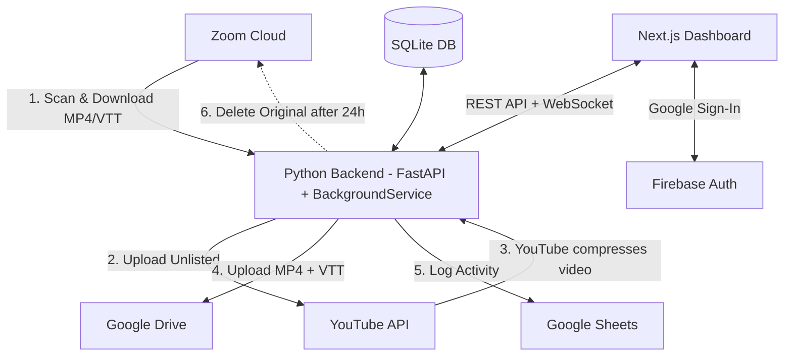

# 🛠️ YTZ Automation — Developer Guide

> Complete technical reference for developers who need to understand, modify, deploy, or troubleshoot the YTZ Automation system.

---

## Table of Contents

1. [System Architecture](#1-system-architecture)
2. [Codebase Structure](#2-codebase-structure)
3. [Core Pipeline Logic](#3-core-pipeline-logic)
4. [API Reference](#4-api-reference)
5. [Database Schema](#5-database-schema)
6. [Configuration](#6-configuration)
7. [Playlist & Keyword Routing](#7-playlist--keyword-routing)
8. [Authentication](#8-authentication)
9. [Google Sheets Integration](#9-google-sheets-integration)
10. [Local Development Setup](#10-local-development-setup)
11. [Production Deployment](#11-production-deployment)
12. [Monitoring & Troubleshooting](#12-monitoring--troubleshooting)
13. [Key Design Decisions](#13-key-design-decisions)

---

## 1. System Architecture



### Component Roles

| Component          | Technology                | Purpose                                        |
|--------------------|---------------------------|------------------------------------------------|
| **Backend**        | Python 3.10+, FastAPI     | Pipeline orchestration, API server              |
| **Frontend**       | Next.js, TypeScript       | Admin dashboard UI                              |
| **Database**       | SQLite                    | Recording state management, system logs         |
| **Task Runner**    | Python `threading.Thread` | Background daemon (scan/process/cleanup cycles) |
| **Auth**           | Google OAuth / Firebase   | Dashboard login, API token verification         |
| **Audit Log**      | Google Sheets API         | Transparent external audit trail                |

---

## 2. Codebase Structure

```
ZoomAutomation/
├── src/                         # Core Python backend
│   ├── main.py                  # BackgroundService — 3-phase pipeline orchestrator
│   ├── api.py                   # FastAPI application (routes, middleware, lifespan)
│   ├── config.py                # All configuration (env vars, paths, dynamic config)
│   ├── zoom_client.py           # Zoom Server-to-Server OAuth + API wrapper
│   ├── youtube_client.py        # YouTube Data API v3 (upload, playlist, captions)
│   ├── drive_client.py          # Google Drive API (upload, folder management)
│   ├── db_sql.py                # SQLite database (singleton, thread-safe)
│   ├── auth.py                  # Google token verification + fallback auth
│   ├── sheets_integration.py    # Google Sheets read/write + audit logging
│   ├── utils.py                 # File naming, retry decorator, date parsing
│   ├── playlist_folders.py      # Playlist-to-folder mapping helpers
│   ├── playlist_manager.py      # Playlist CRUD operations
│   ├── cache.py                 # In-memory TTL cache for API responses
│   ├── metrics.py               # Prometheus metrics counters
│   ├── monitor.py               # Disk space checker, old file cleanup
│   ├── websocket_manager.py     # WebSocket connection manager
│   ├── lock.py                  # File-based process locking
│   ├── notifications.py         # Notification helpers
│   └── history_logger.py        # Extended logging to file
│
├── frontend/                    # Next.js dashboard
│   └── src/
│       ├── app/                 # Next.js pages and layouts
│       ├── components/          # React UI components
│       ├── firebase/            # Firebase auth configuration
│       ├── hooks/               # Custom React hooks
│       └── lib/                 # Utility functions
│
├── config/
│   └── playlists.json           # Keyword → Playlist → Drive folder mapping
│
├── secrets/                     # (git-ignored) OAuth tokens and service accounts
│   ├── client_secret.json       # Google OAuth Desktop App credentials
│   ├── token_youtube.json       # YouTube OAuth token (pickle)
│   ├── token_drive.json         # Drive OAuth token (pickle)
│   └── service_account.json     # Google Service Account (Sheets + Drive)
│
├── data/                        # Runtime data
│   ├── vong_v2.db               # SQLite database
│   └── app.log                  # Application log file
│
├── downloads/                   # Temporary download directory (auto-cleaned)
├── scripts/                     # Setup and deployment scripts
├── deploy/                      # Deployment configurations
├── .env                         # Environment variables (git-ignored)
└── .env.example                 # Template for environment variables
```

---

## 3. Core Pipeline Logic

The pipeline is implemented in `src/main.py` as a `BackgroundService(threading.Thread)`. It runs in a continuous loop with 60-second intervals between cycles.

### Phase 1 — Discovery (Scanning Zoom)

**Method:** `_scan_zoom()`

1. Iterates over all configured Zoom accounts (multi-account support).
2. Calls `ZoomClient.get_all_users()` → `get_user_recordings()` for the last 90 days.
3. For each recording:
   - Extracts the **UUID** (unique per instance) and **meeting ID** (same for recurring).
   - Calls `_resolve_team_playlist(meeting_id, topic)` to match keywords.
   - If matched → inserted as `APPROVED` (zero-touch).
   - If unmatched → inserted as `PENDING_PLAYLIST` (requires admin approval).
4. **Auto-upgrade**: If a previously `PENDING` recording now matches a keyword (config updated), it's upgraded to `APPROVED`.

### Phase 2 — Execution (Processing Queue)

**Method:** `_process_queue()`

For each `APPROVED` recording:

1. **Pre-check**: Verify YouTube quota is not paused.
2. **Download** MP4 + VTT from Zoom using `ZoomClient.download_file()`.
   - Uses UUID first, falls back to meeting ID if UUID fails.
   - UUIDs with `/` are double-URL-encoded per Zoom API requirements.
3. **Upload to YouTube** via `YouTubeClient.upload_video()` as `unlisted`.
   - Handles `quotaExceeded` errors by pausing YouTube operations for 24h.
   - Uploads captions from VTT file.
   - Adds video to the matched playlist (3 retry attempts).
4. **Upload to Google Drive** via `DriveClient.upload_file()`.
   - Download the compressed video from youtube.
   - Video MP4 → team's Drive folder.
   - Transcript VTT → team's transcript subfolder.
5. **Cleanup** local files.
6. **Update status** to `COMPLETED` with YouTube URL, Drive URL, and deletion timestamp.
7. **Log** to Google Sheets.

### Phase 2.5 — Compression Queue

**Method:** `_process_compressing_queue()`

Handles videos stuck in `YOUTUBE_COMPRESSING` state:
- Re-downloads from Zoom and uploads directly to Drive.
- Marks as `COMPLETED` even if YouTube compression is still pending.

### Phase 3 — Cleanup (Zoom Deletion)

**Method:** `_cleanup_zoom_recordings()`

1. Queries recordings where `status = COMPLETED` and `drive_uploaded_at` is > 6 hours ago.
2. **Re-verifies**:
   - YouTube video still exists and has status `uploaded` or `processed`.
   - Drive URL is present.
3. **Only if both verified** → calls `ZoomClient.delete_recording()`.
4. If verification fails → status set to `VERIFICATION_FAILED`, Zoom recording is preserved.

### Auto-Recovery

**Method:** `_auto_recover()` — runs every 10 cycles (~10 minutes)

- **Stuck Processing**: Records in `PROCESSING` for >60 min → reset to `APPROVED`.
- **Error Recovery**: Records in `ERROR` with `retry_count < 3` → reset to `PENDING`.

---

## 4. API Reference

**Base:** FastAPI application at port `8000`.

### Public Endpoints

| Method | Endpoint              | Auth     | Description                                 |
|--------|-----------------------|----------|---------------------------------------------|
| GET    | `/health`             | None     | Simple health check (`{"status": "ok"}`)    |
| GET    | `/health/detailed`    | None     | DB, service, disk, memory checks            |
| GET    | `/metrics`            | None     | Prometheus metrics                          |
| GET    | `/service/status`     | None     | Background service status + uptime          |
| GET    | `/service/health`     | None     | Alias for `/service/status`                 |

### Authenticated Endpoints (require `X-Token` header)

| Method | Endpoint              | Auth     | Description                                 |
|--------|-----------------------|----------|---------------------------------------------|
| POST   | `/auth/login`         | Token    | Verify Google ID token, return user info     |
| GET    | `/stats`              | User     | Recording counts by status (cached 30s)      |
| GET    | `/queue`              | User     | Pending recordings (grouped by meeting ID)   |
| GET    | `/history`            | User     | Completed/errored recordings                 |
| GET    | `/options`            | User     | Available teams and playlists                |
| POST   | `/approve/{zoom_id}`  | User     | Approve a recording + bulk approve recurring |
| GET    | `/logs`               | None     | System logs (structured)                     |
| GET    | `/errors`             | None     | ERROR-level logs only                        |
| POST   | `/sync`               | User     | Trigger sync message                         |
| GET    | `/sheets-url`         | User     | Google Sheets URL                            |

### Service Management Endpoints

| Method | Endpoint              | Auth     | Description                                 |
|--------|-----------------------|----------|---------------------------------------------|
| POST   | `/service/start`      | User     | Start background service                     |
| POST   | `/service/stop`       | User     | Stop background service                      |
| POST   | `/service/restart`    | User     | Restart background service                   |

### WebSocket

| Endpoint | Description                                           |
|----------|-------------------------------------------------------|
| `/ws`    | Real-time updates. Broadcasts `recording_approved` events. |

### Approval Payload

```json
POST /approve/{zoom_id}
Header: X-Token: <google_id_token>
Body: {
  "team": "Tech",
  "playlist": "2.2.4 Tech Systems and Products"
}
```

Response:
```json
{
  "status": "Approved",
  "bulk_approved": 5  // Other pending instances of the same recurring meeting
}
```

---

## 5. Database Schema

**Engine:** SQLite — `data/vong_v2.db`  
**Thread Safety:** `threading.Lock` on all operations, auto-reconnection on failures.

### `recordings` Table

| Column                | Type      | Description                                       |
|-----------------------|-----------|---------------------------------------------------|
| `zoom_id`             | TEXT PK   | Zoom UUID (unique per recording instance)         |
| `meeting_id`          | TEXT      | Numeric Zoom meeting ID (same for recurring)      |
| `account_name`        | TEXT      | Source Zoom account (e.g., "Zoom Account 1")      |
| `topic`               | TEXT      | Meeting title/topic                               |
| `start_time`          | TEXT      | ISO 8601 recording start time                     |
| `date_str`            | TEXT      | Date portion (YYYY-MM-DD)                         |
| `status`              | TEXT      | Current state (see lifecycle below)                |
| `team`                | TEXT      | Assigned team/category                            |
| `playlist`            | TEXT      | Assigned YouTube playlist name                    |
| `approved_by`         | TEXT      | Email of approving admin                          |
| `video_url`           | TEXT      | Zoom download URL                                 |
| `transcript_url`      | TEXT      | Zoom transcript URL                               |
| `youtube_url`         | TEXT      | YouTube video URL (after upload)                  |
| `drive_url`           | TEXT      | Google Drive file URL (after upload)              |
| `metadata`            | JSON      | Full Zoom recording metadata                     |
| `created_at`          | TIMESTAMP | Record creation time                              |
| `error_message`       | TEXT      | Last error message                                |
| `retry_count`         | INTEGER   | Number of retry attempts                          |
| `processed_at`        | TEXT      | Processing start timestamp                        |
| `deletion_ready_at`   | TEXT      | When Zoom deletion becomes eligible               |
| `zoom_deletion_status`| TEXT      | PENDING / DELETED / FAILED / VERIFICATION_FAILED  |
| `zoom_deleted_at`     | TEXT      | Actual deletion timestamp                         |
| `zoom_deletion_error` | TEXT      | Deletion error message                            |
| `drive_uploaded_at`   | TEXT      | Drive upload completion timestamp                 |

### `system_logs` Table

| Column      | Type        | Description                |
|-------------|-------------|----------------------------|
| `id`        | INTEGER PK  | Auto-increment             |
| `level`     | TEXT        | INFO / WARNING / ERROR     |
| `message`   | TEXT        | Log message                |
| `timestamp` | TIMESTAMP   | Log entry creation time    |

### Status Lifecycle

```
PENDING_PLAYLIST → (admin approves) → APPROVED
         ↓ (auto-match)                   ↓
    APPROVED →→→→→→→→→→→→→→→→→→→→→→→ PROCESSING → COMPLETED → ZOOM DELETED
                                          ↓                        ↓
                                        ERROR ←→ (auto-retry) ← FAILED
```

### Auto-Migration

The database auto-migrates new columns when the schema changes (see `_migrate_columns()`). This means old databases are automatically updated when new code is deployed.

---

## 6. Configuration

### Environment Variables (`.env`)

| Variable                       | Required | Default      | Description                                    |
|--------------------------------|----------|--------------|------------------------------------------------|
| `ZOOM_1_ACCOUNT_ID`           | ✅        |              | Zoom S2S OAuth Account ID                       |
| `ZOOM_1_CLIENT_ID`            | ✅        |              | Zoom S2S OAuth Client ID                        |
| `ZOOM_1_CLIENT_SECRET`        | ✅        |              | Zoom S2S OAuth Client Secret                    |
| `ZOOM_2_*`                    | ❌        |              | Additional Zoom accounts (dynamic loading)      |
| `DRIVE_ROOT_FOLDER_ID`        | ✅        |              | Root Google Drive folder ID                     |
| `GOOGLE_WEB_CLIENT_ID`        | ✅        |              | Google OAuth Web Client ID (for dashboard auth) |
| `ADMIN_EMAILS`                | ❌        | `""`         | Comma-separated admin emails                    |
| `DRIVE_AUTH_MODE`             | ❌        | `user`       | `user` (OAuth) or `service_account`             |
| `ENABLE_DRIVE_UPLOAD`         | ❌        | `false`      | Enable Drive uploads                            |
| `ENABLE_AUTO_DELETE`          | ❌        | `true`       | Enable automatic Zoom deletion                  |
| `DELETE_DELAY_HOURS`          | ❌        | `24`         | Hours to wait before Zoom deletion              |
| `YOUTUBE_PRIVACY_STATUS`      | ❌        | `unlisted`   | YouTube upload privacy (`unlisted`/`private`)   |
| `UPLOAD_DELAY_SECONDS`        | ❌        | `30`         | Delay between uploads                           |
| `GOOGLE_SHEET_ID`             | ❌        | *(hardcoded)*| Google Sheets spreadsheet ID                    |
| `ENABLE_SHEETS_INTEGRATION`   | ❌        | `true`       | Enable Google Sheets logging                    |
| `API_HOST`                    | ❌        | `0.0.0.0`    | API bind host                                   |
| `API_PORT`                    | ❌        | `8000`       | API bind port                                   |
| `ENVIRONMENT`                 | ❌        | `development`| `development` or `production`                   |
| `CHECK_INTERVAL`              | ❌        | `3600`       | Config check interval (seconds)                 |
| `ENABLE_ZOHO_INTEGRATION`     | ❌        | `false`      | Enable Zoho Cliq notifications                  |
| `ZOHO_CLIQ_WEBHOOK_URL`       | ❌        |              | Zoho Cliq webhook URL                           |

### Required Secret Files

All placed in `secrets/` directory (git-ignored):

| File                    | Source                          | Purpose                          |
|-------------------------|---------------------------------|----------------------------------|
| `client_secret.json`    | Google Cloud Console            | OAuth Desktop App credentials    |
| `token_youtube.json`    | Generated by `setup_youtube.py` | YouTube OAuth token (pickle)     |
| `token_drive.json`      | Generated at first run          | Drive OAuth token (pickle)       |
| `service_account.json`  | Google Cloud Console            | Service account for Sheets/Drive |

---

## 7. Playlist & Keyword Routing

**Config file:** `config/playlists.json`

Each entry defines a routing rule:

```json
{
  "playlist_id": "PL8yNrvcL-...",        // YouTube playlist ID
  "playlist_name": "2.2.5 Enablers - HR", // Human-readable name
  "category": "HR",                       // Team/category label
  "drive_folder_id": "1m9Y...",           // Google Drive folder for videos
  "transcript_folder_id": "1ekd...",      // Google Drive folder for transcripts
  "meeting_ids": ["81198809795"],         // Exact Zoom meeting ID matches (Priority 1)
  "keywords": ["hr", "recruitment"]       // Topic keyword matches (Priority 2)
}
```

### Matching Priority

1. **Meeting ID match** (exact numeric match) — highest priority.
2. **Keyword match** (case-insensitive substring) — second priority.
3. **No match** → `PENDING_PLAYLIST` (admin assigns manually).

### Adding a New Category

1. Create the YouTube playlist on the A4G-Collab channel.
2. Create the Google Drive folder (and transcript subfolder).
3. Add an entry to `playlists.json` with the IDs and keywords.
4. Restart the backend service.

---

## 8. Authentication

**File:** `src/auth.py`

### Flow

1. Frontend gets a Google ID token via Firebase Auth (Google Sign-In).
2. Frontend sends the token as `X-Token` header with every API call.
3. Backend verifies using `google.oauth2.id_token.verify_oauth2_token()`.
4. If strict verification fails (e.g., clock skew), a **fallback** decodes the JWT without signature verification, checking:
   - Token expiry (allows up to 7-day grace period).
   - Issuer is Google or Firebase.
   - Email is present.

### Role System

| Role    | Permissions                           |
|---------|---------------------------------------|
| `user`  | View queue, approve recordings        |
| `admin` | All user abilities + system logs/settings |

> **Note:** Currently all authenticated users are assigned `admin` role (temporary override in `auth.py` line 45).

---

## 9. Google Sheets Integration

**File:** `src/sheets_integration.py`

The system maintains a Google Sheet with multiple tabs:

| Tab Name        | Purpose                                      |
|-----------------|----------------------------------------------|
| `Main`          | Recording registry (Date, ID, Title, Status, Links) |
| `Settings`      | Command state (IDLE/START/REFRESH)           |
| `System_Logs`   | Timestamped log entries                      |
| `Dashboard`     | Summary metrics (Total Processed, Storage Saved) |

### Rate Limiting

All Sheets API calls use `@retry_on_quota` decorator:
- Retries on HTTP 429, 500, 503.
- Exponential backoff: 10s → 30s → 60s.
- Max 3 retries.

---

## 10. Local Development Setup

### Prerequisites

- **Python 3.10+** (with `pip`)
- **Node.js 20+** (with `npm`)
- Google Cloud Project with:
  - YouTube Data API v3
  - Google Drive API
  - Google Sheets API
- Zoom Server-to-Server OAuth App
- Firebase project (for frontend auth)

### Step 1 — Clone & Backend Setup

```bash
git clone https://github.com/A4Gcollab/ZoomAutomation.git
cd ZoomAutomation

# Create virtual environment
python -m venv venv

# Activate (Windows)
.\venv\Scripts\activate

# Install dependencies
pip install -r requirements.txt
```

### Step 2 — Frontend Setup

```bash
cd frontend
npm install
cd ..
```

### Step 3 — Configure Secrets

1. Copy `.env.example` to `.env` and fill in all values.
2. Place credential files in `secrets/`:
   - `client_secret.json` (from Google Cloud Console → OAuth 2.0 Client IDs)
   - `service_account.json` (from Google Cloud Console → Service Accounts)
3. Generate YouTube token:
   ```bash
   python scripts/setup_youtube.py
   ```
   This opens a browser for Google OAuth consent. The token is saved as `secrets/token_youtube.json`.

### Step 4 — Run

**Option A: Batch file (Windows)**

```bash
.\Start_Automation.bat
```

**Option B: Manual (all services)**

```bash
# Terminal 1 — Backend API + Background Service
uvicorn src.api:app --host 0.0.0.0 --port 8000

# Terminal 2 — Frontend
cd frontend && npm run dev
```

The dashboard will be available at `http://localhost:3000` and the API at `http://localhost:8000`.

---

## 11. Production Deployment

### Server Requirements

- **OS**: Ubuntu 22.04 LTS
- **RAM**: 2 GB minimum (for frontend build)
- **Disk**: 50 GB NVMe (recommended)
- **Provider**: Vultr VPS (recommended)

### Automated Deployment

```bash
# On the VPS
cd /opt
git clone https://github.com/A4Gcollab/ZoomAutomation omysha-automation
cd omysha-automation && chmod +x scripts/deploy.sh && ./scripts/deploy.sh
```

The deploy script handles:
1. Python + system utilities installation.
2. Node.js v20 installation.
3. Python and npm dependency installation.
4. Frontend production build.
5. Nginx and systemd configuration.

### Post-Deploy

1. **Add secrets**: `nano .env` and paste your environment variables.
2. **Setup SSL**: `certbot --nginx -d za.omysha.org`
3. **Restart**: `systemctl restart omysha-backend && systemctl restart nginx`

### Pushing Code Updates

```powershell
# From local machine
scp -r src root@YOUR_SERVER_IP:/home/ytzapp/ZoomAutomation/
```

Then on the VPS:
```bash
systemctl restart ytz-backend    # or omysha-backend
```

### DNS Configuration

Add an `A` record:  
- **Name**: `za` (creates `za.omysha.org`)  
- **Value**: Server IP address

---

## 12. Monitoring & Troubleshooting

### Live Logs (VPS)

```bash
# Real-time backend logs
journalctl -u omysha-backend -f

# Or: journalctl -u ytz-backend -f
```

### API Health Checks

```bash
# Simple
curl https://za.omysha.org/health

# Detailed (DB, service, disk, memory)
curl https://za.omysha.org/health/detailed
```

### Prometheus Metrics

```
GET /metrics
```

Available metrics: `api_requests_total`, `api_latency_seconds`, `recordings_processed_total`, `active_websockets`, `background_service_status`.

### Common Issues

| Issue                          | Solution                                              |
|--------------------------------|-------------------------------------------------------|
| **502 Bad Gateway**            | Backend not running. Run `systemctl restart omysha-backend` and check `journalctl`. |
| **YouTube quota exceeded**     | Auto-pauses for 24h. Check YouTube API Console for quota usage. |
| **Token expired errors**       | Re-run `python scripts/setup_youtube.py` to refresh OAuth tokens. |
| **Videos stuck in PROCESSING** | Auto-recovery resets after 60 min. Check disk space with `/health/detailed`. |
| **Zoom deletion failed**       | Check `zoom_deletion_error` in the database. Often the recording was already deleted. |
| **Permission denied (Drive)**  | Verify service account has Editor access to the Drive folder. |
| **Login redirect loop**        | Verify `za.omysha.org` is added to Firebase authorized domains. |

### Force-Processing a Video (VPS)

```bash
cd /home/ytzapp/ZoomAutomation && ./venv/bin/python -c "
import sys; sys.path.insert(0, '.')
from src.db_sql import db
p = db.get_pending()
if p:
    rec = p[0]
    db.update_recording(rec['zoom_id'], {
        'status': 'APPROVED',
        'team': 'Tech',
        'playlist': '2.2.4 Tech Systems and Products',
        'approved_by': 'ManualOverride'
    })
    print(f\"Forced: '{rec['topic']}' to APPROVED!\")
"
```

### Database Direct Access (VPS)

```bash
sqlite3 /home/ytzapp/ZoomAutomation/data/vong_v2.db

-- Check pending recordings
SELECT zoom_id, topic, status FROM recordings WHERE status IN ('PENDING', 'PENDING_PLAYLIST');

-- Check errors
SELECT zoom_id, topic, error_message, retry_count FROM recordings WHERE status = 'ERROR';

-- Check deletion status
SELECT zoom_id, topic, zoom_deletion_status FROM recordings WHERE status = 'COMPLETED';
```

---

## 13. Key Design Decisions

### Why YouTube as a Compression Layer?

Zoom recordings are massive (1-4 GB for a 1-hour meeting). YouTube's encoder produces much smaller files (~80-90% reduction) at comparable quality. By uploading to YouTube and then storing the compressed version on Drive, we save significant storage costs.

### Why UUID as Primary Key?

Zoom's `meeting_id` is the same for all instances of a recurring meeting. The `uuid` is unique per recording session. Using UUID as the primary key prevents collisions between different instances of the same recurring meeting.

### Why SQLite?

- Zero-configuration, embedded database.
- Thread-safe with explicit locking.
- Auto-migration support for schema changes.
- Single-file backup (`data/vong_v2.db`).
- Sufficient for the expected throughput (~50-100 recordings/week).

### Why Double URL-Encoding for Zoom UUIDs?

Zoom UUIDs containing `/` or starting with `/` must be double-encoded per Zoom's API specification. The `_encode_uuid_for_zoom()` method handles this transparently.

### Why 24-Hour Deletion Delay?

Provides a safety buffer to detect upload failures. The system re-verifies both YouTube and Drive before deleting from Zoom, ensuring no data loss.

### Retry Strategy

All external API calls use `@retry_with_backoff` decorator:
- Exponential backoff with jitter (2s → 4s → 8s).
- Prevents thundering herd on transient failures.
- YouTube quota errors pause all uploads for 24 hours instead of retrying.

---

*This guide covers the YTZ Automation System v2.1. For non-technical users, see the User Guide.*
